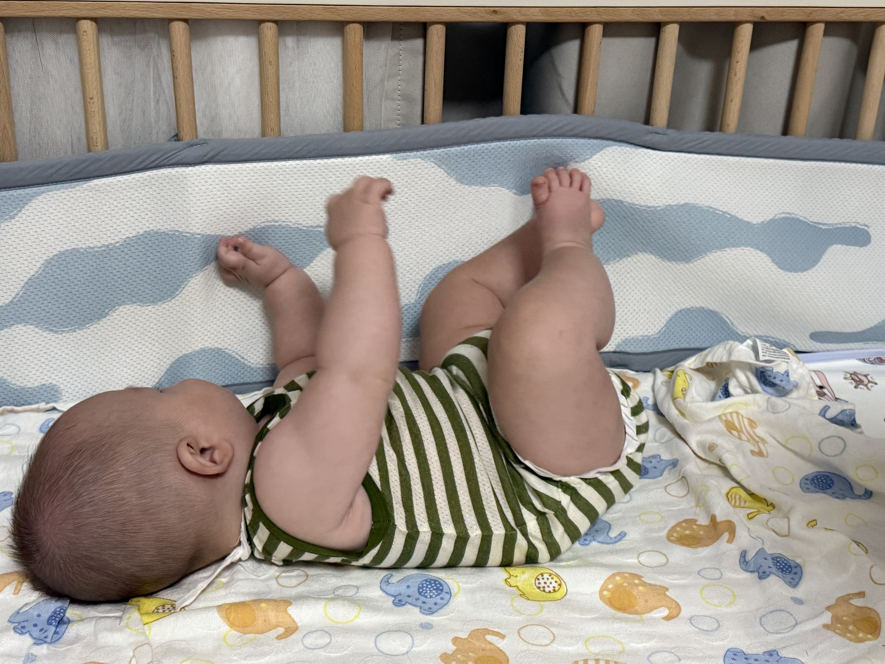
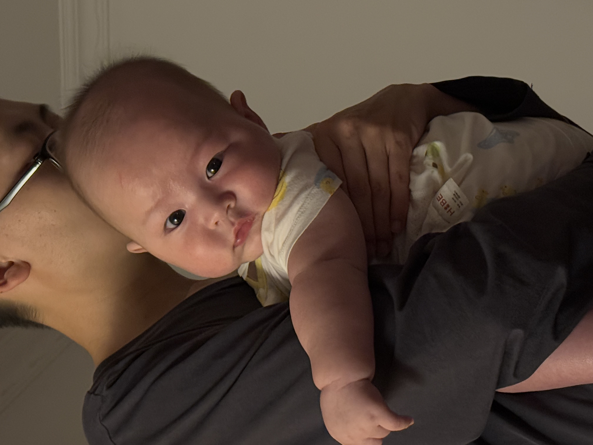
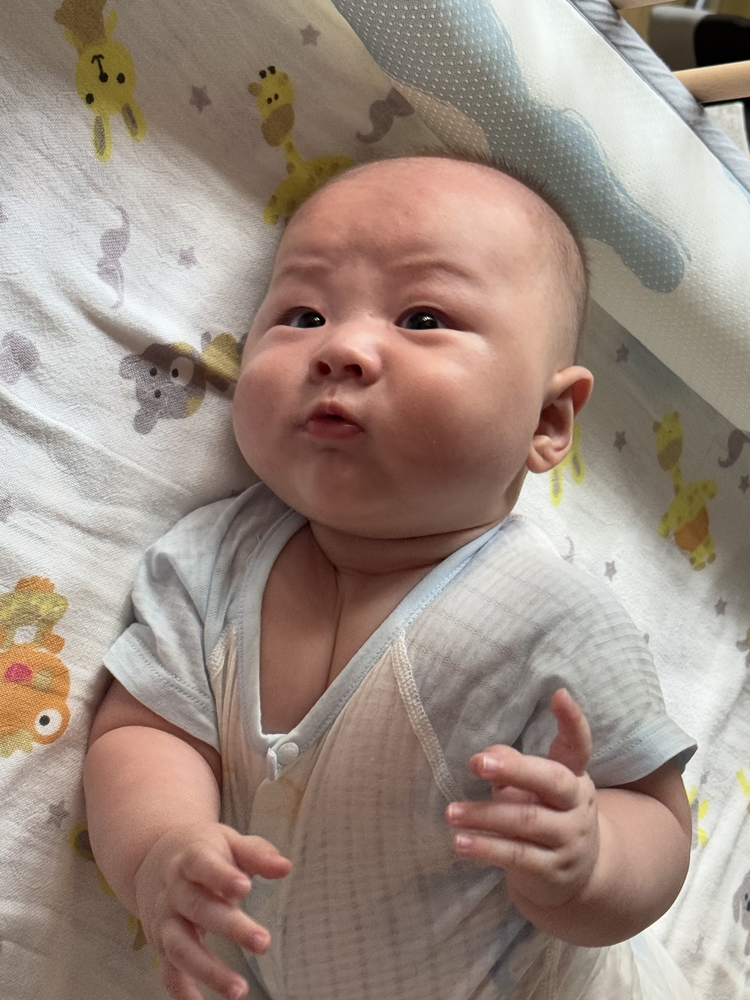
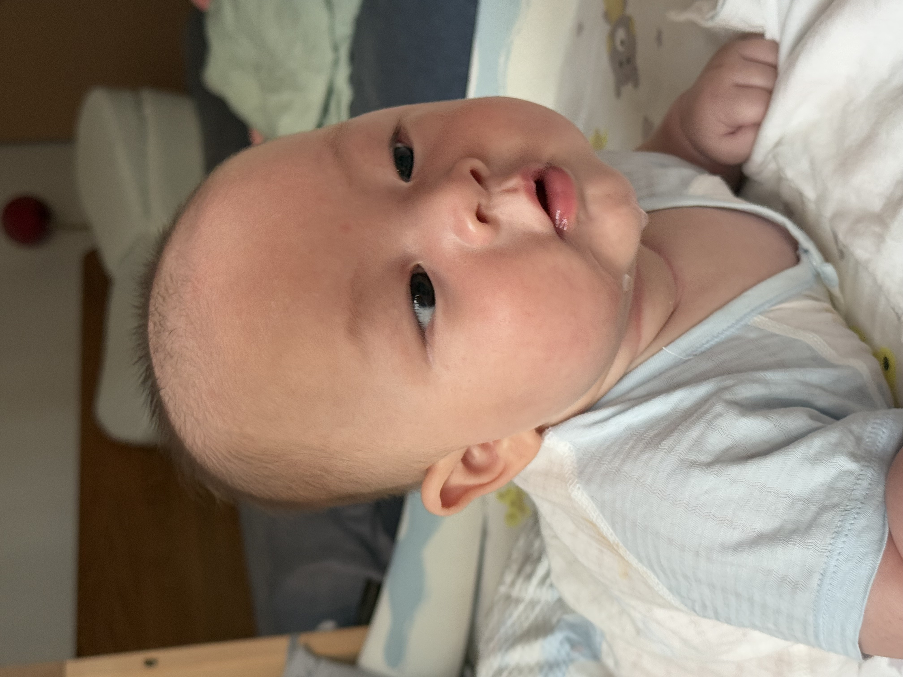
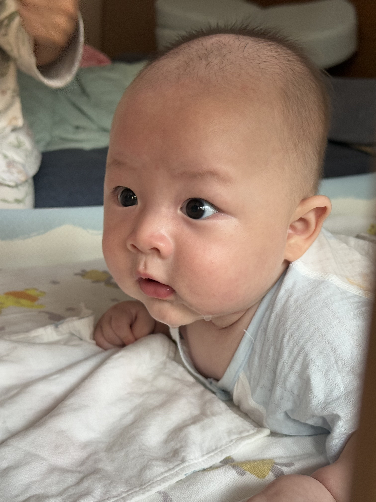
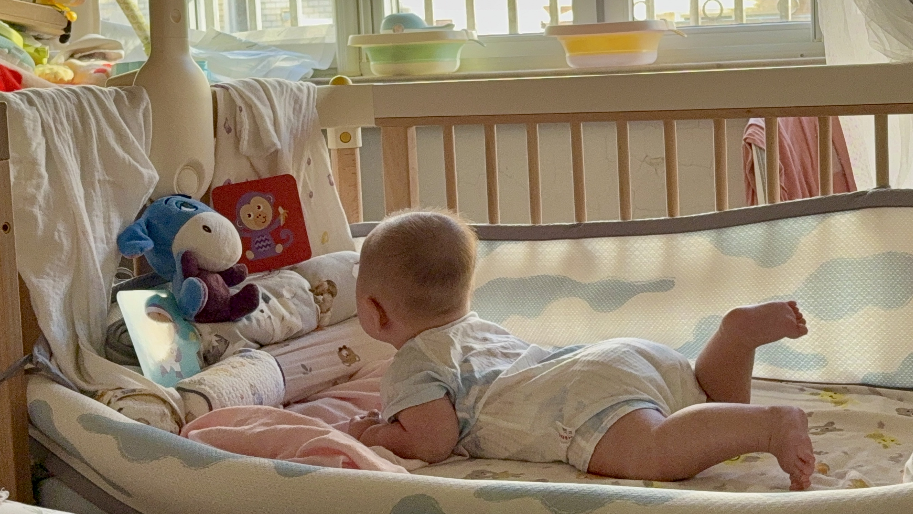
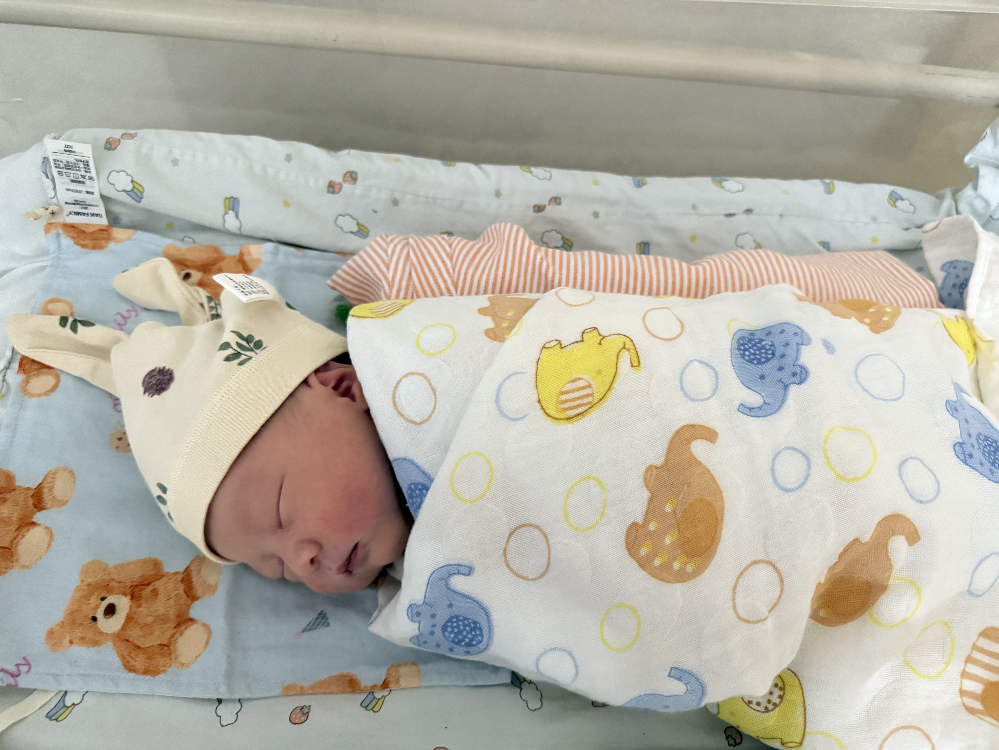

#### 07-28
正好五月龄，体重有9kg出头，穿上粉红色的耀西连体服（妈妈同款），尝试前倾坐！

  

#### 07-21
尝试培养肚肚的自主入睡能力，不每次都萝卜蹲或者摇动哄睡了。我侧躺在床上对着老儿子念经，讲三只小猪的故事。他睁着大眼睛盯着我的嘴巴，不知道我在做什么，肉肉的小手本来搭在我的手臂上，突然啪嗒一声重重地落下去，我就知道这个傻孩子他睡着了🥱zzz

  

#### 07-19
肚肚已经比较认母了，只要我在，人群中他总是目光锁定在我身上，然后张嘴漏出同款类似哆啦A梦的纯真笑容👶🏻。

他学会翻身（但还没那么稳，翻过去可能定不住）之后，夜里睡觉会像海浪一样一浪一浪地扑向我的这一边。我也顺势搂住我的老儿子（如果不挡住，他会以脑袋为圆心身体翻滚扫出圆的轨迹），在他身后垫上糖果枕。我睡觉也更需要小心翼翼了，真是甜蜜的负担啊，只不过重点落在甜蜜上😊。

#### 07-15
肚肚已经是翻身小达人了，还会在自己的小床上努力攀爬。

  

#### 07-13
最近有一个发现，宝宝是特别懂大人情绪的。
1. 你对着他假笑，他也只会回复你一个礼貌性的微笑。
2. 在哄睡的时候，一旦你失去耐心，一心只想达到让他睡着的目的，他会变得暴躁难哄，突然爆哭、伸手打掉你的眼镜，很长时间都睡不着。

所以我告诉自己一定要尽可能地温柔（这可不是我日常的性格），在哄睡的时候也会化身一个唐僧，小声对着肚肚说妈妈有多爱他、他有多么幸福。

#### 07-10
在世纪公园，cruz座驾上练习抬头，好奇肚肚可以坚持20min了。

  

#### 07-03
阿崽的耳朵是我发掘出来的一个萌点，上半部分翘翘的，下半部分贴贴的，像个小精灵🧚

  

#### 07-02
肚肚小品集《大王叫我来巡山》

A：报告大王！唐僧师徒一行四人已经渡河，朝咱们山洞的方向过来了！

B：废物！不是早就告诉你们化装作农户，在河的那岸就截住他们吗？？

A：小的该死小的该死！被那孙猴子识破了！求大王饶命啊！！

  
  
  

#### 07-01
进入四月龄，小胖子抬头终于可以轻松10min啦！

  

阿崽还有几个有意思的变化：

1. 昨天突然有一次可以双手捧住奶瓶，自己喝奶啦！

2. 既五月初开始说“阿咕”开始，最近进入婴语大爆发期，经常自言自语，我也会重复他的发音假装和他对话😂 目前他的发音还是以u音为主，比如：唔、咕、布、木 ~ （所以很可能也会很快会说自己的小名哦）另外，还出现过类似mom、ba的发音。

#### 06-21
最近没有偷懒，都有在好好练习抬头哦。有那么多肉肉，抬头可费力啦。

  
  

  

#### 06-20
被一包乐事薯片逗得好开心啊

  
  

#### 06-18
继续去世纪公园的荷塘边小睡😴

  

#### 06-16
很喜欢新买的床铃玩具，对着上面会旋转的小挂件看的很仔细，一个个地"迎来送往"。

  

#### 06-14
今天第一次把肚肚弄到世纪公园遛弯了，躺在睡篮里因为天气热到红温。

  
  

#### 06-11
老肚自个儿看着房顶笑的可开心了，我一掏出手机记录，他立马就屏住了。或许他是爱捣蛋的淘气包，而我是严厉的班主任吧。

  
  

#### 06-08
老肚100天了，时间真快，真喜欢当他的妈妈。

他的体重达到了7.55kg，成为彻彻底底的小胖胖。今天出门有人问他是不是略微超重(overweight)啦😂终于再也不是满42天之前一直被医生说太瘦，需要换特殊奶粉的瘦小子了！

今天上海入梅，下着大雨，我们带他出去徐汇拍摄照片，好折腾这个崽子，刚坐上车就一通暴哭，过百天却不能舒舒服服。

  

相馆照片还没拿到，我先自己偷拍了几张花絮。

  
  

自肚崽出生前,我就对身边人千叮咛万嘱咐拍照关闭闪光灯，但我却在今天是用闲置很久的拍立得的时候，忘记关掉了😢

#### 06-07
儿子穿小背心，露出身上的肉肉真的很可爱。最近他很爱笑。随着身体的进化，夜里不再需要抱起来睡了，同时也很明显地能够认出我来了。

  
  

#### 06-02
最近肚肚可以举起两只手臂了，每天都在仔细观察自己的手手，还经常两手握在一起做出“恭喜恭喜”的动作。

  

#### 06-01
肚崽坐上新买的婴儿提篮，为下周坐车出门拍百天照做准备。包裹得严严实实的提篮上，他变得好严肃哦。

  
  

#### 05-28

我儿子的颜值真高，躺着和竖抱起来，由于肉肉的走向不同，他有不同的样子。最近常常被他开心时候发出的一连串奶音吸引过去。马上就满90天了，夜里仍旧哼唧、扭动、抓脸不停。

  
  

#### 05-19
每天盯着自己的手手看，有时候还举起手来看。对什么都充满好奇~

  

#### 05-18
最近阿崽视力发展很快，似乎能看清楚更多的东西，开始对家里的物品产生了极浓厚的兴趣。比如哆啦A梦读书灯😇

  

以前只会舔舔小拳头，现在学会吮吸大拇指了。

  

#### 05-06
开心的时候会发出"阿咕"的奶音

  

#### 03-23
肚肚有了新的进化，吵闹的时候用右手捂住左耳朵。可爱极了这个崽子。

  

#### 03-01
肚肚正式和大家见一面吧～

  

#### 02-28
今天22:42，3320g的肚崽出生了！我真是费了九牛二虎之力呀！当他趴在我身上的时候，他是一小只但又沉甸甸的一团肉肉，很胆小地感受着陌生的世界。

他趴了大概半小时，我十分虚弱、疲惫，但是又如释重负。我感受着他的细微动作，真的很像前面几个月怀孕时候的胎动。这一刻，我和胎宝肚肚告别啦。

  

