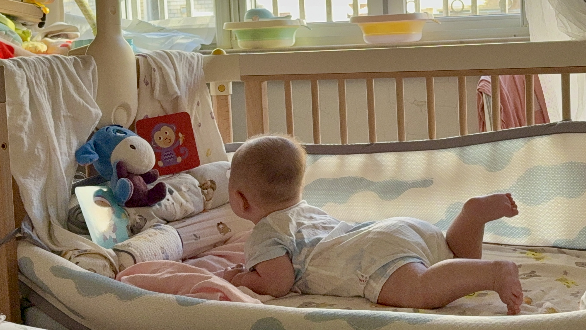

This is a local-only demo page for image layout and sizing.

Manual sizing (classes):

Gallery (auto cols):



Gallery with fixed cols:



Masonry layout:



WeChat layout (with zoom):



Forced ratio (4/3):



Figure shortcode:



Video sizing:



<video class="w-60 center" controls preload="metadata" poster="assets/poster.jpg">
  <source src="assets/demo.mp4" type="video/mp4">
</video>

WeChat video:


